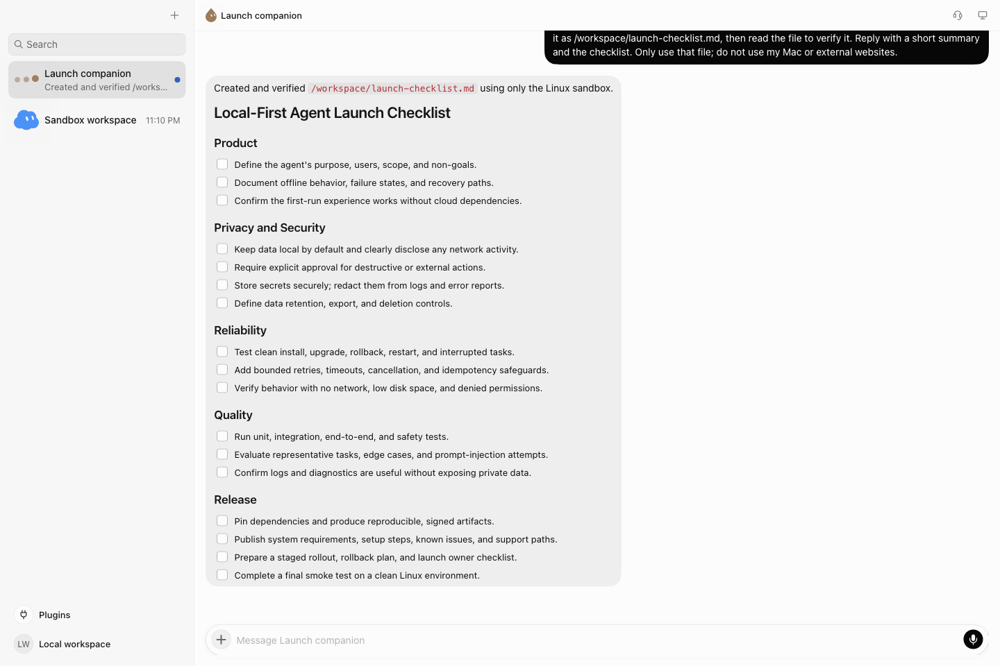
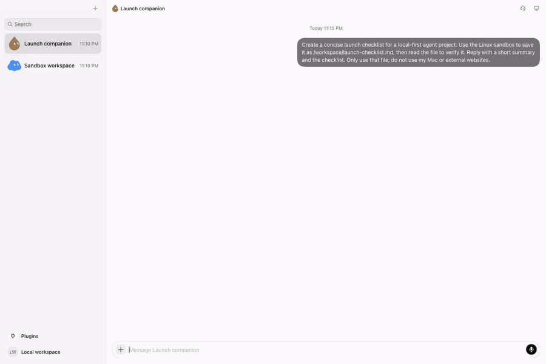

[English](README.md) · 简体中文

<p align="center">
  
</p>
<h1 align="center">Grokbot Harness</h1>
<p align="center"><strong>让 Agent 动手做事，把工作留在你的工作区。</strong></p>
<p align="center">桌面对话 · 本地 Sandbox · 自选模型 · MCP 与 Skills</p>
<p align="center">
  <a href="#快速开始">快速开始</a> ·
  <a href="https://river-li.github.io/brok-pot-harness/">项目网站</a> ·
  <a href="docs/wiki/Home.md">文档</a> ·
  <a href="docs/wiki/Features.md">功能</a> ·
  <a href="docs/wiki/Marketplace.md">Starter marketplace（英文）</a> ·
  <a href="docs/wiki/Architecture.md">架构</a> ·
  <a href="CONTRIBUTING.md">参与开发</a>
</p>

**Grokbot Harness（GBH）是一个可自行构建的桌面 Agent 工作区。** 连接你选择的 Responses API，
让 Agent 在本地 Linux Sandbox 中读写文件、执行命令、检索网页，并通过 MCP 和 Skills 扩展工具。
任务、工具过程和结果集中在同一个桌面界面中。

<p align="center">
  <a href="docs/media/agent-demo.mp4"></a>
</p>
<p align="center"><sub>真实任务：发送指令 → 创建清单 → 读取检查 → 返回结果。</sub><br />
  <a href="docs/media/agent-demo.mp4">观看视频</a> · <a href="docs/media/agent-result.png">查看完整截图</a>
</p>

<details>
<summary>展开 Agent 执行过程（GIF）</summary>



演示压缩了等待时间。[媒体说明与复现方法](docs/media/README.md)

</details>

## 把对话变成工作成果

| 工作能力 | 运行选择 |
| --- | --- |
| **在自己的工作区执行**<br />将项目目录挂到 `/workspace`，让 Agent 读取资料、运行脚本、生成文件。 | **使用自己选择的模型**<br />配置 Responses API 地址、模型名和 key，支持流式回复与工具调用。 |
| **把常用工具接进来**<br />连接 stdio、HTTP 或 SSE MCP 服务，管理本地插件与 Skills。 | **保留执行控制**<br />用只读挂载保护参考资料，分别设置 Auto-review 与 Mac 本机工具权限。 |
| **从网页到语音**<br />通过 SearXNG 搜索、提取网页；用本地 Whisper 听写、Kokoro 预览语音。 | **构建属于自己的桌面**<br />生成带项目图标的 macOS App，按需调整 Sandbox image 和运行配置。 |

默认 `local` 构建无需厂商账号，关闭厂商登录、计费、云端部署和远端同步。
推理请求会发送到你配置的 API；模型、搜索和 MCP 可以使用网络。

## 快速开始

当前桌面验证平台为 **Intel macOS**。准备 **Node.js 22.16+、Python 3.9+、npm、Docker Desktop**，
以及支持流式输出和工具调用的 **Responses API**。首次启动需要下载容器镜像与语音模型。

**1. 安装依赖** — 在仓库根目录运行：

```sh
npm ci
npm ci --prefix runtime
# 首次配置；已有 .env 时直接编辑它
cp .env.example .env
```

**2. 连接模型** — 编辑 `.env`，替换以下三个占位值：

```dotenv
GROKBOT_RESPONSES_BASE_URL=https://api.example.com/v1
GROKBOT_MODEL=your-model-id
LITELLM_API_KEY=your-api-key
```

`.env` 已被 Git 忽略；也可以通过 shell 提供 key。
[密钥与配置规则](docs/wiki/Configuration.md) 说明优先级和本机 API 的连接方式。

**3. 构建并启动：**

```sh
npm run build -- --profile local
npm run prepare:desktop -- --profile local
npm start
npm run status
# 服务 healthy 后启动桌面
npm run start:desktop -- --profile local
```

在桌面创建 Bot，试试：**“在 /workspace 创建一份项目启动清单，保存为 Markdown，再读取检查内容。”**
文件默认保存在仓库的 `.runtime/workspace`。用 `npm stop` 停止后端，文件和会话会保留。

[完整安装指南](docs/wiki/Build-Guide.md) · [挂载自己的项目](docs/wiki/Sandbox.md) ·
[生成 macOS App](docs/wiki/Packaging.md) · [启动遇到问题？](docs/wiki/Troubleshooting.md)

## 按你的工作方式配置

- **模型与功能开关** → [API、build profile 和运行选项](docs/wiki/Configuration.md)
- **执行环境** → [自定义 image、目录挂载与数据备份](docs/wiki/Sandbox.md)
- **工具权限** → [Auto-review、本机执行与 Keychain](docs/wiki/Permissions.md)
- **工具扩展** → [Starter marketplace 与 Bot recipes（英文）](docs/wiki/Marketplace.md) · [MCP、插件与 Skills](docs/wiki/Extensions.md)
- **阅读源码** → [架构与请求流程](docs/wiki/Architecture.md) · [Package 地图](packages/README.md)

## 开发与项目范围

GBH 在保留 Grok Bot 发布代码结构的基础上做本地适配，目前处于开发预览阶段。
桌面对话、真实模型工具调用、Sandbox 文件操作、MCP/插件、听写和语音预览已有集成验证。
完整语音通话、Mac GUI 等能力仍在完善；支持范围见 [功能文档](docs/wiki/Features.md)。

欢迎从配置体验、工具适配、文档和测试入手。[贡献指南](CONTRIBUTING.md) 提供代码定位与验证路径；
[源码恢复说明](docs/wiki/Source-Recovery.md) 解释这份代码库的构建方式。

### 资源与许可

仓库包含保留的上游代码与资源，相关声明见 [资源来源](vendor/README.md) 和各资源目录。
这些资源保留各自的许可条件；项目未声明覆盖全部上游资源的统一开源许可证。
