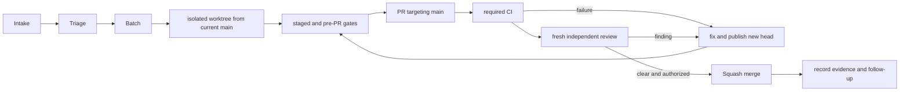

# Maintainer workflow

Use this page to take a useful issue through implementation, independent review, merge, and follow-up. The issue forms and [issue triage guide](Issue-Triage.md) collect and assess reports; this page explains how maintainers turn selected work into one reviewable delivery. Repository AGENTS.md files remain authoritative for source and component constraints.



## Triage the report

Start with the complete issue and the matching [bug, feature, or documentation form](../../.github/ISSUE_TEMPLATE). Check current issues for the same behavior before creating another. Mark a duplicate only when its build profile, baseline, component, and reproduction describe the same problem; link the canonical issue. Similar symptoms can have different causes.

For a bug, capture the affected release or commit, build profile, Host baseline, platform, steps, expected result, and observed result. Ask for the last known good and first known bad revision when a regression is suspected. Reproduce the smallest useful case before treating a hypothesis as a confirmed defect.

For a feature, identify the user task and an observable result. For documentation, name the page or missing instruction and what a reader should be able to do afterward. Keep unrelated ideas out of the acceptance criteria. If a required detail is missing, ask one focused question and leave the report open.

After triage, assign one area label, one priority label, and the appropriate status label as authorized. Priority describes execution order: high work unblocks a prerequisite or dependent delivery, normal work is actionable without a reason to go first, and low work can wait. Record impact separately; severity alone does not set priority. The [triage guide](Issue-Triage.md) owns label definitions, status rules, privacy, and form maintenance.

## Choose a delivery and schedule it

Group work by outcome, not by issue count. One PR can resolve several related issues when they share a cause or deliverable. Include the code, tests, and documentation needed to understand and protect that outcome. A small documentation correction normally travels with the feature or fix it explains. A standalone documentation PR is appropriate when it forms a useful, coherent guide on its own.

Write acceptance criteria that describe the observable result and the evidence that will show it. Keep deferred ideas and independent defects as follow-ups. Do not leave a dependency on an unmerged branch: wait for the prerequisite to land, then start the next task from the updated main branch.

The coordinator handles priority, scheduling, ownership, and routing. Assign one implementation owner and one worktree to each PR. Coordinate before two tasks touch the same files or behavior; serialize overlapping edits. Unrelated work can proceed separately when ownership and test resources do not conflict.

## Investigate and implement

Fetch current main, then create an isolated worktree from it. Confirm the starting commit and clean status:

```sh
git fetch origin main
git worktree add -b agent/<slug> .runtime/worktrees/<slug> origin/main
cd .runtime/worktrees/<slug>
git status --short --branch
git rev-parse HEAD
```

Keep one implementation owner for an overlapping set of files. The coordinator assigns and schedules work; when two deliveries need the same files or behavior, finish and merge the prerequisite first, then create the next worktree from updated main. Independent work can proceed at the same time when ownership and test resources do not overlap.

Read the root and applicable scoped AGENTS.md, the relevant module README, and the architecture or recovery guide for the source being changed. Trace the maintained source, existing behavior, and relevant tests before editing. For bugs, record what you observed separately from what you inferred. If the symptom does not reproduce, say what you tried and what remains unknown.

Change maintained source, not generated output. In this repository, .runtime/build is reconstructed from reconstruction-manifest.json; sand-host is the immutable baseline. Recovered fragments keep their markers, order, and emitted identifiers. Local adapters under packages/grok-bot-harness/src/local use strict TypeScript. Preserve local/original profile behavior, retained vendor implementations, and action approval paths.

Add or update tests for the changed behavior and update the documentation that describes the changed behavior or supported workflow. Keep both in the same PR as their owning implementation. Choose checks from [Development](Development.md), [Source recovery](Source-Recovery.md), and the [runtime test guide](../../runtime/tests/README.md). Run npm run docs:check after documentation edits and git diff --check before handoff. Do not run live provider checks unless the task specifically authorizes them.

## Prepare one PR for main

Before publishing, review the full diff and changed-file list. Confirm that the branch descends from current main, the working tree contains only this delivery, and generated files, secrets, profiles, user data, and unrelated cleanup are absent. If main advanced, update the branch from origin/main and rerun affected checks.

Every PR targets main and comes from a branch based on current main. Do not stack PRs or depend on code that has not merged. Use the short [PR template](../../.github/PULL_REQUEST_TEMPLATE.md). In the visible explanation, say what problem the change fixes, how behavior changes, how its parts work together, and what remains unverified. Keep exhaustive file lists, commands, and full commit IDs in a collapsed details section.

After the pre-PR command fetches main, inspect the exact delivery before pushing:

```sh
git status --short --branch
git diff --stat origin/main...HEAD
git diff origin/main...HEAD
```

Install dependencies with npm ci --no-audit --no-fund when needed. The optional staged hook is installed explicitly with npm run hooks:install; it checks only the index and refuses to replace an existing configured hook. Before publishing, run npm run ci:pre-pr. It fetches current origin/main, checks that this is a clean linked worktree on a task branch containing that main commit, selects checks from the committed change paths, and checks the exact branch diff. Git can verify present ancestry; it cannot prove where the branch was first created or whether changes were copied from an unmerged branch. CI separately rejects PR targets other than main and bases that are no longer current.

CI and pre-PR use the same gate runner. Markdown-only changes run recovery and documentation checks; code, tests, configuration, and workflow changes run the local build, type, recovery, runtime-build, syntax, documentation, and offline contract checks. Both check whitespace against a verified source range. npm run ci:required is the CI entry point and needs its GitHub event context; use npm run ci:pre-pr locally. Failed commands exit nonzero. Fix the cause, rerun the same command, then publish the updated head; any new head needs fresh CI and independent review. If main advances, update from current main and rerun pre-PR checks. The staged hook is a convenience and can be bypassed. Main protection requires the offline gates check from GitHub Actions app 15368; that server-side rule is the merge barrier.

Automated gates do not decide whether work is usefully scoped, technically sound, clearly explained, or independently reviewed. Those require a maintainer and a separate reviewer to read the actual change. The workflow cannot infer those judgments from issue counts, labels, or a text pattern.

Use Refs #123 while any required issue criteria remain open or deferred. Use Fixes #123 only when this delivery satisfies the full issue and automatic closure on merge is intended. Related issues can be listed together; issue count does not determine PR count.

## Review and merge

After the PR is published, a separate reviewer in a fresh worktree checks the exact head SHA against its declared main base. The reviewer reads every changed file, checks the design and behavior, reruns relevant checks, and reports concrete findings and evidence limits. The coordinator routes findings; the PR author does not approve their own work. A same-account review is a comment, not independent GitHub approval. The current branch rule requires zero GitHub approvals because this publishing account cannot supply an independent approval; the process still requires a separate agent's published-head comment and verdict.

Write the human review summary in Chinese. Name the reviewed head and base. Separate blocking findings from non-blocking observations and point to files and lines where possible. A verdict applies only to that head/base pair. Any changed head or base invalidates the old verdict; the author fixes findings and the reviewer checks the new published head.

On this repository, adding the `review:pending` label starts `.github/workflows/claude-review.yml`. That workflow invokes the Claude Code action with its configured OAuth token and asks it to submit an `APPROVE` or `REQUEST_CHANGES` review. The label is therefore an action trigger, not a neutral pending marker. For the Luna or same-account review path, leave all `review:*` labels off while a fresh review is pending. The separate reviewer posts a GitHub `COMMENT` with a clear `READY_TO_MERGE` or `NEEDS_CHANGES` verdict, the exact head and base SHAs, and the Chinese summary. The coordinator records that result and applies the existing `review:ready-to-merge` or `review:changes-requested` label. A same-account `COMMENT` is process evidence, not a GitHub approval. When the head or base changes, remove any old final verdict label and route a fresh review; the earlier verdict no longer applies. Do not add `review:pending` unless the Claude workflow is intentionally being started.

Merge only when required checks pass, the independent review has no blockers, and a human or explicitly authorized coordinator has merge authority. Squash merge the PR into main. A ready verdict is not itself permission to merge or release.

## Close the issue or carry the follow-up

After merge, record the merge commit, check and review evidence, and remaining limits in the issue or PR. Close the issue only when its acceptance criteria are met and the closure is authorized. Keep it open with Refs when criteria remain unmet. Create a separate issue for useful deferred work, with its impact, expected result, and evidence or reproduction; do not use a follow-up to hide an incomplete acceptance criterion.

If the merged change causes a regression, link the evidence to the original PR and issue, then send a revert or repair PR through the same checks and independent review. Do not rewrite main history. Close or reopen the original issue based on whether its reported behavior is actually resolved.

## Worked example

Suppose a report says a manifest-mapped recovered bundle no longer appears after a local-profile build. The triager checks for the same report, asks for the affected revision and profile if they are missing, and records the expected artifact and observed build result. The implementation owner starts a worktree from current main, reads the manifest and [source-recovery guide](Source-Recovery.md), and reproduces the failure with the relevant recovery test.

If the cause is a missing mapping, the owner changes the maintained manifest or source mapping and adds a regression test. If the build or recovery instructions also need correction, that documentation change ships in the same PR. The owner runs the local build, recovery and runtime-build tests, npm run docs:check, and git diff --check. The PR explains the lost artifact and the fix in plain English, then records exact evidence and commit IDs in its collapsed details.

The required CI check then runs against the PR merge checkout while identifying the source head and base. Once it passes, a separate reviewer checks that published head. A blocking finding sends the PR back to the owner; the fix creates a new head and the reviewer checks it again. After a clean review and explicit merge authorization, the coordinator squash-merges it. The issue closes with the merged commit and passing evidence. An unrelated recovery issue stays in the backlog.

---
[Development](Development.md) · [Issue triage](Issue-Triage.md) · [CI](CI.md) · [Verification](Verification.md)
