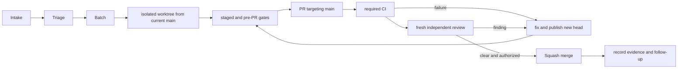

# Maintainer workflow

Use this page to take a useful issue through implementation, independent review, merge, and follow-up. The issue forms and [issue triage guide](Issue-Triage.md) collect and assess reports; this page explains how maintainers turn selected work into one reviewable delivery. Repository AGENTS.md files remain authoritative for source and component constraints.

The repository-owned [maintenance CLI](../../tools/README.md#agent-maintenance-workflow) prepares registered task worktrees and prints read-only triage and PR readiness evidence. This page remains the policy source; the CLI does not replace review judgment or merge authority.



## Triage the report

Start with the complete issue and the matching [bug, feature, or documentation form](../../.github/ISSUE_TEMPLATE). Check current issues for the same behavior before creating another. Mark a duplicate only when its build profile, baseline, component, and reproduction describe the same problem; link the canonical issue. Similar symptoms can have different causes.

For a bug, capture the affected release or commit, build profile, Host baseline, platform, steps, expected result, and observed result. Ask for the last known good and first known bad revision when a regression is suspected. Reproduce the smallest useful case before treating a hypothesis as a confirmed defect.

For a feature, identify the user task and an observable result. For documentation, name the page or missing instruction and what a reader should be able to do afterward. Keep unrelated ideas out of the acceptance criteria. If a required detail is missing, ask one focused question and leave the report open.

After triage, assign one area label, one priority label, and the appropriate status label as authorized. Priority describes execution order: high work unblocks a prerequisite or dependent delivery, normal work is actionable without a reason to go first, and low work can wait. Record impact separately; severity alone does not set priority. The [triage guide](Issue-Triage.md) owns label definitions, status rules, privacy, and form maintenance.

For a bounded read-only report, run `npm run maintenance -- triage --limit 100`. It queries up to 100 current-repository issues and workflow runs, groups exact normalized issue-title matches and repeated workflow/event/branch failures, and links the evidence. Grouping proposes where to inspect; it does not confirm duplicates or a shared failure cause. Issue bodies and run logs are not included. The command does not post, label, or create issues, and it is not scheduled for unattended writes.

## Choose a delivery and schedule it

Group work by outcome, not by issue count. One PR can resolve several related issues when they share a cause or deliverable. Include the code, tests, and documentation needed to understand and protect that outcome. A small documentation correction normally travels with the feature or fix it explains. A standalone documentation PR is appropriate when it forms a useful, coherent guide on its own.

Write acceptance criteria that describe the observable result and the evidence that will show it. Keep deferred ideas and independent defects as follow-ups. Do not leave a dependency on an unmerged branch: wait for the prerequisite to land, then start the next task from the updated main branch.

The coordinator handles priority, scheduling, ownership, and routing. Assign one implementation owner and one worktree to each PR. Coordinate before two tasks touch the same files or behavior; serialize overlapping edits. Unrelated work can proceed separately when ownership and test resources do not conflict.

### Design before delegation

The coordinator owns the design. Before assigning implementation, trace the relevant
code and write a bounded task brief with:

- The intended user flow and observable result, including a UI reference when applicable.
- The existing components to reuse, interfaces and data ownership, and profile/approval invariants.
- The exact files the worker may change and the concrete changes expected in them.
- The checks to run, their required modes, and the evidence to return. Build success,
  syntax checks, screenshots and actual runtime execution establish different things.
- A review checkpoint before integrating the next component or expanding the task.

Workers read code and implement that design. If the design cannot fit the existing
interfaces, they report the mismatch to the coordinator before changing architecture
or scope. A failed live check requires a captured error and a specific diagnosis;
do not repeatedly relaunch the same flow without learning from the failure. The
coordinator checks the actual diff and command results, not only the worker's summary.

## Investigate and implement

Run setup from the primary checkout, which may be on another branch and may contain uncommitted user changes. The CLI fetches the current base, checks issue/dependency state, reserves ownership, and creates a separate linked worktree without switching or resetting the primary checkout:

```sh
npm run maintenance -- task start --issue 123 --slug focused-change \
  --owner implementation-agent --reviewer coordinator-agent \
  --reviewer-account github-reviewer-login \
  --path tools/maintenance.py --path tools/test_maintenance.py \
  --accept "observable behavior is delivered" \
  --check "npm run test:recovery" \
  --rollout "verify the published page after merge" \
  --depends-on-pr 120
cd .runtime/worktrees/focused-change
git status --short --branch
git rev-parse HEAD
```

Repeat `--path`, `--accept`, and `--check` for each owned path, acceptance outcome, and pre-merge check. Each `--depends-on-pr` must name a PR that is already merged and whose merge commit is in the fetched current `main`; wait for an open prerequisite to merge and update `main` before starting. Omit the option only when there is no prerequisite, never to bypass an unmerged dependency. Use `--rollout` only for evidence expected after merge. Paths are repository-relative and a directory reserves all descendants. The task bundle records the implementation owner, separately designated reviewer agent, trusted GitHub account for process verdicts, acceptance, checks, rollout, dependency evidence, exact starting main SHA, and handoff steps.

Keep one implementation owner for an overlapping set of files. The coordinator assigns and schedules work; when two deliveries need the same files or behavior, finish and merge the prerequisite first, then create the next worktree from updated main. Independent work can proceed at the same time when ownership and test resources do not overlap.

The ownership registry lives in shared Git metadata and coordinates only tasks started from this checkout. Overlapping registered scopes fail and identify the current owner; ask the coordinator to compare work in other clones or unregistered tasks. Setup refuses an existing branch, bundle, or worktree path and never overwrites them. Git verifies the fetched starting commit and current ancestry, but cannot prove historical branch creation or detect commits copied from unmerged work. Run `npm run maintenance -- task list` to inspect reservations and `npm run maintenance -- task release --slug <slug> --reason "..."` to release ownership after handoff; release leaves files, branches, and worktrees intact.

Read the root and applicable scoped AGENTS.md, the relevant module README, and the architecture or recovery guide for the source being changed. Trace the maintained source, existing behavior, and relevant tests before editing. For bugs, record what you observed separately from what you inferred. If the symptom does not reproduce, say what you tried and what remains unknown.

Change maintained source, not generated output. In this repository, .runtime/build is reconstructed from reconstruction-manifest.json; sand-host is the immutable baseline. Recovered fragments keep their markers, order, and emitted identifiers. Local adapters under packages/grok-bot-harness/src/local use strict TypeScript. Preserve local/original profile behavior, retained vendor implementations, and action approval paths.

Add or update tests for the changed behavior and update the documentation that describes the changed behavior or supported workflow. Keep both in the same PR as their owning implementation. Choose checks from [Development](Development.md), [Source recovery](Source-Recovery.md), and the [runtime test guide](../../runtime/tests/README.md). Run npm run docs:check after documentation edits and git diff --check before handoff. Do not run live provider checks unless the task specifically authorizes them.

## Prepare one PR for main

Before publishing, review the full diff and changed-file list. Confirm that the branch descends from current main, the working tree contains only this delivery, and generated files, secrets, profiles, user data, and unrelated cleanup are absent. If main advanced, update the branch from origin/main and rerun affected checks.

Every PR targets main and comes from a branch based on current main. Do not stack PRs or depend on code that has not merged. Use the short [PR template](../../.github/PULL_REQUEST_TEMPLATE.md). In the visible explanation, say what problem the change fixes, how behavior changes, how its parts work together, and what remains unverified. Keep exhaustive file lists, commands, and full commit IDs in a collapsed details section.

After the pre-PR command fetches main, inspect the exact delivery before pushing:

```sh
git status --short --branch
git diff --stat origin/main...HEAD
git diff origin/main...HEAD
```

Install dependencies with npm ci --no-audit --no-fund when needed. The optional staged hook is installed explicitly with npm run hooks:install; it checks only the index and refuses to replace an existing configured hook. Before publishing, run npm run ci:pre-pr. It fetches current origin/main, checks that this is a clean linked worktree on a task branch containing that main commit, selects checks from the committed change paths, and checks the exact branch diff. Git can verify present ancestry; it cannot prove where the branch was first created or whether changes were copied from an unmerged branch. CI separately rejects PR targets other than main and bases that are no longer current.

CI and pre-PR use the same gate runner. Markdown-only changes run recovery and documentation checks; code, tests, configuration, and workflow changes run the local build, type, recovery, runtime-build, syntax, documentation, and offline contract checks. Both check whitespace against a verified source range. npm run ci:required is the CI entry point and needs its GitHub event context; use npm run ci:pre-pr locally. Failed commands exit nonzero. Fix the cause, rerun the same command, then publish the updated head; any new head needs fresh CI and independent review. If main advances, update from current main and rerun pre-PR checks. The staged hook is a convenience and can be bypassed. Main protection requires the offline gates check from GitHub Actions app 15368; that server-side rule is the merge barrier.

Automated gates do not decide whether work is usefully scoped, technically sound, clearly explained, or independently reviewed. Those require a maintainer and a separate reviewer to read the actual change. The workflow cannot infer those judgments from issue counts, labels, or a text pattern.

Keep the visible PR description concise and human-readable: explain the problem, concrete behavior change, and design choices. Put exhaustive commands, file lists, full SHAs, and evidence in a collapsed section using the [PR template](../../.github/PULL_REQUEST_TEMPLATE.md). A checklist or generated report supports review; it does not replace it.

Use Refs #123 while any required issue criteria remain open or deferred. Use Fixes #123 only when this delivery satisfies the full issue and automatic closure on merge is intended. Related issues can be listed together; issue count does not determine PR count.

## Review and merge

After the PR is published, a separate reviewer in a fresh worktree checks the exact head SHA against its declared main base. The reviewer reads every changed file, checks the design and behavior, reruns relevant checks, and reports concrete findings and evidence limits. The coordinator routes findings; the PR author does not approve their own work. A same-account review is a comment, not independent GitHub approval. The current branch rule requires zero GitHub approvals because this publishing account cannot supply an independent approval; the process still requires a separate agent's published-head comment and verdict.

The coordinator may also serve as reviewer when explicitly designated for the task and distinct from the implementation owner/PR author. This keeps the reviewer role separate while allowing the coordinator to perform the technical review. GitHub records the posting account but does not identify which agent used it. Use the prior task designation and the actual reviewer's role as process evidence; never accept an identity asserted only in a comment body.

Write the human review summary in Chinese. Name the reviewed head and base. Separate blocking findings from non-blocking observations and point to files and lines where possible. A verdict applies only to that head/base pair. Any changed head or base invalidates the old verdict; the author fixes findings and the reviewer checks the new published head.

For a current machine-readable evidence report, run `npm run maintenance -- pr readiness <number>`. If no task assignment is registered, pass `--reviewer-account github-reviewer-login`; without an explicit or registered account binding, it reports evidence but never says ready. The command reads current PR metadata, current `main` SHA, required checks, every paginated GitHub review record, and the exact PR head commit. GitHub's compare response does not include a `head_commit` field: readiness verifies the requested head with the separate commit lookup, then requires the compare response's base and merge base to equal current main, `status: ahead`, `ahead_by > 0`, and `behind_by = 0`. It re-reads PR and main refs after collection; a head, base, or main movement makes the report unstable.

A process verdict is a `COMMENTED` review with a natural-language summary first and a `GBH review evidence` details block containing `verdict: READY_TO_MERGE` or `verdict: NEEDS_CHANGES`, `head-sha: <full-sha>`, and `base-sha: <full-sha>`. The review API's `commit_id` must also equal the current head. Only the explicitly designated GitHub account is accepted; an outsider comment is evidence but cannot qualify. `NEEDS_CHANGES`, a current formal `CHANGES_REQUESTED` review, or GitHub's `reviewDecision: CHANGES_REQUESTED` blocks readiness. A later plain comment cannot erase an outstanding formal request-changes review. A stale verdict, failed or pending current required check, old main ancestry, or active `review:pending` label cannot produce a ready report. This report is read-only; it does not submit reviews, approve, merge, execute PR code, or decide review quality.

On this repository, adding the `review:pending` label starts `.github/workflows/claude-review.yml`. That workflow invokes the Claude Code action with its configured OAuth token and asks it to submit an `APPROVE` or `REQUEST_CHANGES` review. The label is an action trigger, not a neutral pending marker; this maintenance workflow never adds it. The separate reviewer posts a GitHub `COMMENT` with a clear verdict, exact head and base SHAs, and a Chinese summary. A same-account `COMMENT` is process evidence, not a GitHub approval. The account must have been designated in the task policy or readiness command. A coordinator may review when explicitly designated and distinct from the implementation owner. The coordinator can use the same GitHub account as the author when that distinct-agent role was assigned; GitHub account metadata cannot prove which agent used that account.

The trusted `.github/workflows/invalidate-review-readiness.yml` removes stale `review:ready-to-merge`, `review:changes-requested`, and `review:pending` labels on head synchronization, base edits, and pushes to main. It checks out code from the trusted main branch and uses only `contents:read` and `pull-requests:write`; it never checks out or runs PR code with a privileged token. The labels endpoint is under the shared Issues API route, but PR label removal requires pull request write permission in the [GitHub Agentic Workflows safe-output permission map](https://github.github.com/gh-aw/specs/safe-outputs-specification/). Readiness also rejects stale comment SHAs, so the label cleanup is an operational signal rather than the sole protection.

Merge only when required checks pass, the independent review has no blockers, and a human or explicitly authorized coordinator has merge authority. Squash merge the PR into main. A ready verdict is not itself permission to merge or release.

Separate merge checks from post-merge rollout. An initial Pages or release-infrastructure PR can merge when its code/configuration and required CI are ready; it does not need a production site or release that can only be created after merge. Record expected rollout checks explicitly and verify them after merge. Do not change `Fixes` to `Refs` only because a deployment runs after merge; use `Fixes` when issue acceptance is satisfied and automatic closure is intended. If live rollout is itself an unsatisfied issue criterion, keep that issue open with `Refs` until rollout evidence is recorded.

## Close the issue or carry the follow-up

After merge, record the merge commit, check and review evidence, and remaining limits in the issue or PR. Close the issue only when its acceptance criteria are met and the closure is authorized. Keep it open with Refs when criteria remain unmet. Create a separate issue for useful deferred work, with its impact, expected result, and evidence or reproduction; do not use a follow-up to hide an incomplete acceptance criterion.

If the merged change causes a regression, link the evidence to the original PR and issue, then send a revert or repair PR through the same checks and independent review. Do not rewrite main history. Close or reopen the original issue based on whether its reported behavior is actually resolved.

## Worked example

Suppose a report says a manifest-mapped recovered bundle no longer appears after a local-profile build. The triager checks for the same report, asks for the affected revision and profile if they are missing, and records the expected artifact and observed build result. The implementation owner starts a worktree from current main, reads the manifest and [source-recovery guide](Source-Recovery.md), and reproduces the failure with the relevant recovery test.

If the cause is a missing mapping, the owner changes the maintained manifest or source mapping and adds a regression test. If the build or recovery instructions also need correction, that documentation change ships in the same PR. The owner runs the local build, recovery and runtime-build tests, npm run docs:check, and git diff --check. The PR explains the lost artifact and the fix in plain English, then records exact evidence and commit IDs in its collapsed details.

The required CI check then runs against the PR merge checkout while identifying the source head and base. Once it passes, a separate reviewer checks that published head. A blocking finding sends the PR back to the owner; the fix creates a new head and the reviewer checks it again. After a clean review and explicit merge authorization, the coordinator squash-merges it. The issue closes with the merged commit and passing evidence. An unrelated recovery issue stays in the backlog.

---
[Development](Development.md) · [Issue triage](Issue-Triage.md) · [CI](CI.md) · [Verification](Verification.md)
