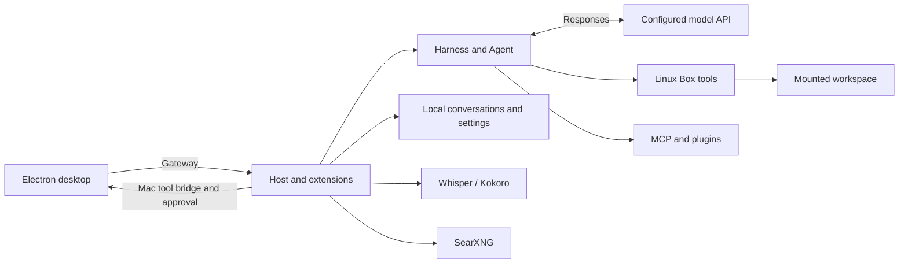

# Architecture

The repository root is the build root. `packages/grok-bot-harness` is the agent orchestration package;
the repository also contains the desktop, Host, shared protocols, execution libraries, and infrastructure.

## A task through the system

1. **Send a message:** Electron connects to the Host Gateway using a local token.
2. **Accept and schedule:** session, transcript, and turn-execution extensions manage messages, state, and lifecycle.
3. **Assemble an Agent:** the Harness combines prompts, tools, memory, and execution ports; Agent handles model output and tool iterations.
4. **Call models and tools:** the Responses adapter invokes your API; tools execute in the Box, through MCP, or via the Mac bridge.
5. **Return the result:** tool output feeds back into Agent; Host persists the final response and updates the desktop.

Host and Box share the `app` container. Search and speech are separate services.
A source package is a maintenance boundary, not necessarily a separate process.

## Code map

| Directory | Responsibility | Start reading |
| --- | --- | --- |
| [src/host](../../src/host/README.md) | Startup, Gateway, sessions, service composition | `main.ts` → `host-boot.ts` → `extensions/registry.ts` |
| [src/shared](../../src/shared/README.md) | Settings, protocols, shared structures and utilities | `gateway/`, `settings/`, `local-exec/` |
| [Harness](../../packages/grok-bot-harness/README.md) | Agent product orchestration, toolsets, capability ports | `src/runner/`, `src/ports/` |
| [Local adapters](../../packages/grok-bot-harness/src/local/README.md) | Models, MCP, plugins, web, and speech services | `responses.ts` and capability-specific adapters |
| [packages](../../packages/README.md) | Agent core, execution, storage, protocols | Browse the package map by responsibility |
| [dune](../../dune/README.md) | Extension lifecycle, RPC, stores, scheduling | `src/host-extensions/` |
| [runtime](../../runtime/README.md) | Build, launchers, desktop resources, services, tests | `manage.cjs`, `desktop.cjs`, `tools/` |
| [reconstruction](../../reconstruction/README.md) | Bundle-specific variants and standalone resources | Mappings in the root manifest |
| [tools](../../tools/README.md) | Release bundle recovery, source navigation, change impact, and documentation export | `recovery-impact.py`, `recover-native.py`, `export-wiki.py` |
| [vendor](../../vendor/README.md) / `sand-host` | Dependencies, desktop assets, immutable release baseline | Resource provenance manifests |

## Similar names, different layers

- **Host / Harness / Agent:** application lifecycle and persistence; product capability composition; inference and tool state.
- **agent-exec / local-exec / shell-exec:** Agent execution interfaces; concrete environment implementations; shell processes and policies.
- **agent-kv / agent-store / transcript:** key-value/blob storage; retained storage sync; Host message and run lifecycle.
- **Host extensions / MCP / plugins:** internal lifecycle services; an external tool protocol; installable user-facing bundles.

Package README files identify entry points and neighboring modules.
Host dependencies come from `extension.ts`; see the [extension map](../../src/host/extensions/README.md).

## Source and build model

Recovered source fragments are reassembled into bundles using the manifest.
Local adapters compile independently as strict TypeScript. Recovered `.ts` and `dist/*.js` can refer to original bundle-scope
symbols; they are not individually executable modules and should not receive guessed imports.
See [Source recovery](Source-Recovery.md).

`local` and `original` share maintained source, with policy loaded before application startup.
Vendor account implementations remain in source. See [feature switches](Configuration.md#build-time-feature-switches).

---
[Documentation](Home.md) · [Get started](Build-Guide.md) · [Configuration](Configuration.md) · [Project](../../README.md)
