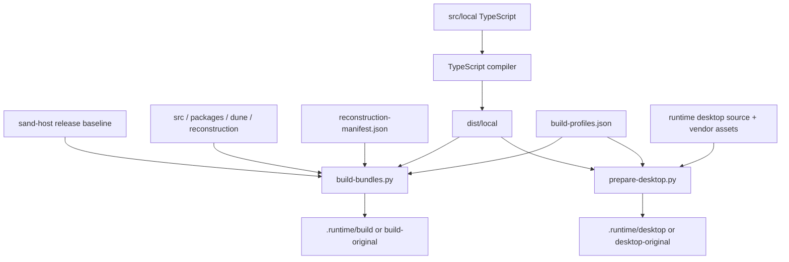

# Source recovery and builds

This repository preserves a release's module layout and maintains local adapters alongside it.
There are two source forms; understanding them prevents edits to the wrong output or damage to bundle scope.

## Two source forms

| Kind | Location | How to maintain it |
| --- | --- | --- |
| Recovered release fragments | `src/`, `dune/`, most of `packages/` | Preserve identifiers, fragment boundaries, and ordering; reassemble through the manifest |
| Standalone strict TypeScript | `packages/grok-bot-harness/src/local/` | Maintain normal imports/types and check with `tsconfig.local.json` |

Recovered `.ts` files may still contain emitted JavaScript. Most package `dist/*.js` files are maintained source here,
not disposable compiler output. Original types and imports were erased and cannot be recovered completely from the bundles.
These packages are not published as independently installable/buildable npm workspaces. Build at the repository root.

## From source to runtime



`npm run build` compiles local adapters, then reconstructs 23 release JS/MJS/CJS artifacts from manifest mappings.
`prepare:desktop` assembles desktop resources. Each profile loads its policy before application code.
See [build profile implementation](../../runtime/BUILD_PROFILES.md).

## Fragments and manifests

`// @recovered-fragment i/n` markers map to byte ranges in a bundle. A logical module can initialize in multiple fragments
or appear differently across bundles. `reconstruction/variants` preserves those differences;
`reconstruction/standalone` holds standalone scripts.

- [reconstruction-manifest.json](../../reconstruction-manifest.json): origins, fragment ranges, and clean-baseline hashes.
- `.runtime/build/build-manifest.json`: actual outputs including maintained changes.
- [sand-host](../../sand-host): immutable release baseline; do not implement features by editing it.
- [reconstruction](../../reconstruction/README.md): variants, standalone resources, and their roles.

Do not bulk-format fragments, invent missing imports, or rewrite release bytes to remove trailing blank lines.
Locate mapped source, make the change there, rebuild, and run relevant checks.

## Navigate source and review change impact

Use the read-only navigator to move from a release artifact offset, symbol, or maintained path to its mapped fragments and bundle variants:

```sh
npm run recovery:map -- --source packages/grok-bot-harness/src/runner/sand-agent-runner.ts
npm run recovery:map -- --symbol SandAgentRunner
npm run recovery:map -- --artifact host-main.cjs --offset 25087222
```

Artifact offsets are zero-based UTF-8 byte positions in the immutable `sand-host` release bundle, which is the coordinate system stored in the manifest. A rebuilt artifact can shift after earlier fragments change. Symbol matches are lexical and may include comments or strings.

Generate an impact report for the current Git diff with `npm run recovery:impact`, or compare against another base with `npm run recovery:impact -- --base origin/main`. The report maps changed files to artifacts and both profile output roots, shows neighboring bundle fragments and same-directory modules for interface review, and recommends checks for the changed component. Neighboring files are context based on bundle order or directory; the report does not infer a dependency graph. Untracked, non-ignored files are included.

Run `npm run recovery:check` to validate all fragment marker counts and order, manifest ranges and release bundle hashes, protected `sand-host` edits, and generated `.runtime/build` contents when present. A clean worktree reports no recovery source drift. `npm run recovery:check -- --source PATH` limits the run to selected source markers and explicitly skips full bundle/build verification.

Static import detection is a lexical advisory. It can match comments, strings, and retained syntax, so it never blocks the check; review any reported candidate manually.

## Export a clean recovery

```sh
npm run recover
```

The default destination is `.runtime/recovered-clean`. Existing destinations are rejected and maintained source is untouched.
Choose a new directory for another export:

```sh
npm run recover -- --output .runtime/recovered-review
```

[Recovery tools](../../tools/README.md) perform extraction. [Runtime tools](../../runtime/tools/README.md) build runnable artifacts.

## Versions and provenance

Host baseline: **bfe1879**. Retained desktop resources: **0.44.0**. Current runtime Electron: **42.1.0**.
The manifest records 2,104 logical source paths; bundle variants produce more physical files.
Resource origins and SHA-256 manifests are described in [vendor](../../vendor/README.md).
These versions support traceability; feature support is described in [Verification](Verification.md).

---
[Documentation](Home.md) · [Get started](Build-Guide.md) · [Configuration](Configuration.md) · [Project](../../README.md)
